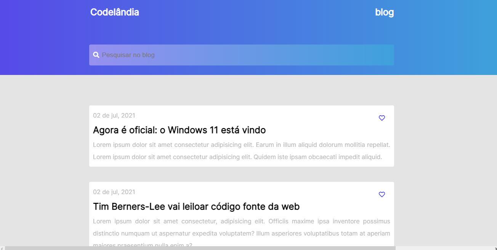
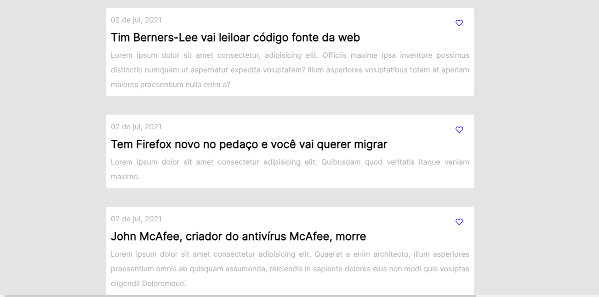
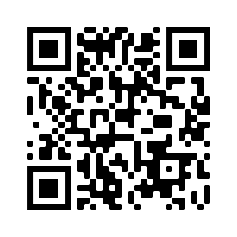

<h1>Primeiro desafio da Codelândia  <em>First Codelândia project</em></h1>

<h4>🖐 Olá, este e o primeiro desafio da comunidade do <a href="https://github.com/iuricode">Iuri Silva (iuricode)</a> no Discord. E uma página simples mas que trabalha com o posicionamento dos elementos na página e um pouco de animação também. Espero que gostem!</h4>
 
<h4><em>🖐 Hello, this is the first project of the <a href="https://github.com/iuricode">Iuri Silva's</a> community on Discord. It's a simple page, but she works with elements position and a bit of animation. I hope you like it!</em></h4>

<h3>📸 Algumas fotos do projeto:  <em>📸 Some photos of the project:</em></h3>
 

<h3>Link do projeto para quem quiser dar uma olhada:  <em>Link of the project for you to view:</em></h3>  
<h3><a href="https://hugocamposarimathea.github.io/Desafio-1/" target="_blank">👉 Clique aqui 👈   <em>👉 Click here to go 👈</em></a></h3> 
 
<h3>Ou aponte a câmera para o QR Code abaixo: 📱  <em>Or point your cellphone camera to QR code below: 📱</em></h3> 
 

 

<h3>📧 Caso queira conversar:  <em>📧 If you want to talk with me, send me an email:</em></h3> 

  
   
 
 

